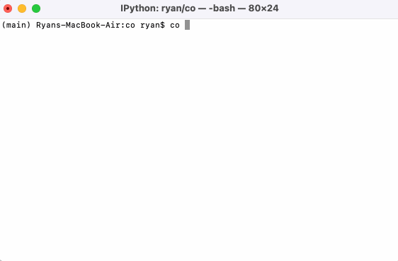

<div align="center">
<h1>co</h1>

A pure Python terminal based text editor inspired by Visual Studio Code. 

</img>
</div>

## Install

```
pip install git+https://github.com/yrmo/co.git
```

## Usage

```
usage: co [-h] filename

positional arguments:
  filename    The file to edit

options:
  -h, --help  show this help message and exit
```

### Key bindings

`↑`/`↓`/`←`/`→` - Navigate.

`Tab` - Tab.

`^S` - Save.

`^W` - Exit.

`^C` - Copy.

`^V` - Paste.

`^A` - Go to start of line.

`^E` - Go to end of line.

`^K` - Delete line.
